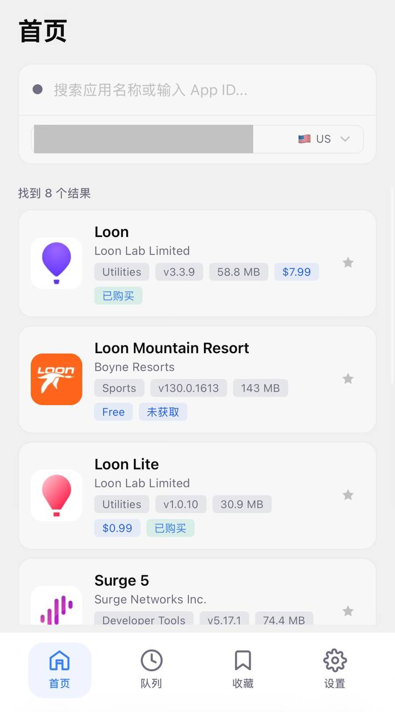
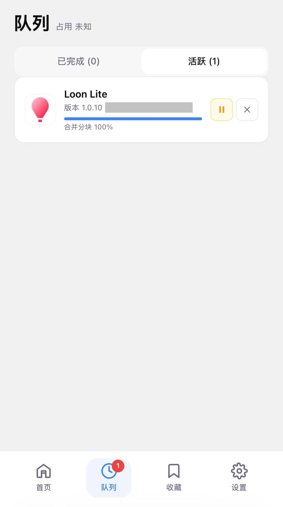
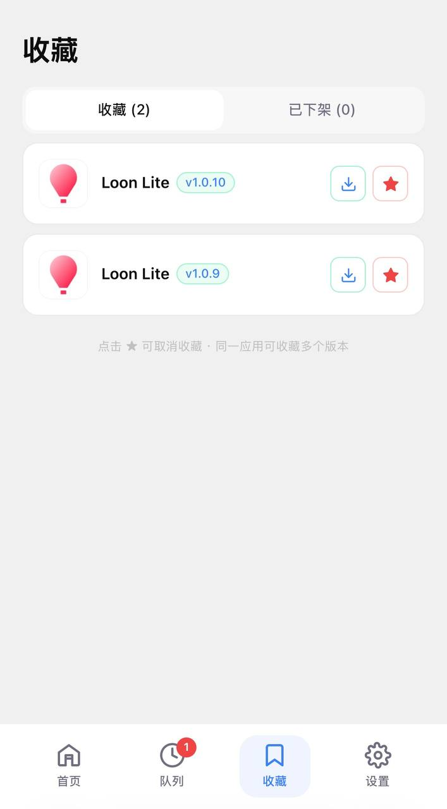
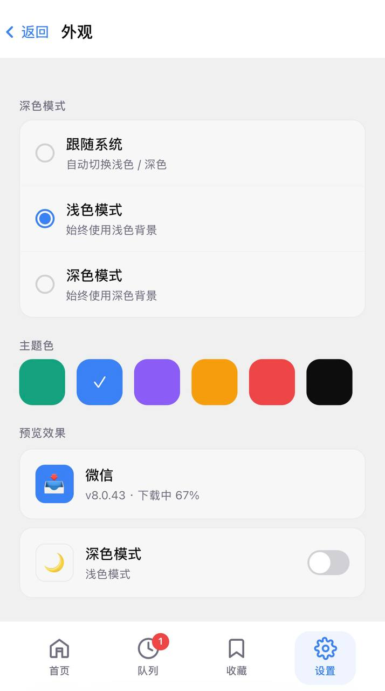
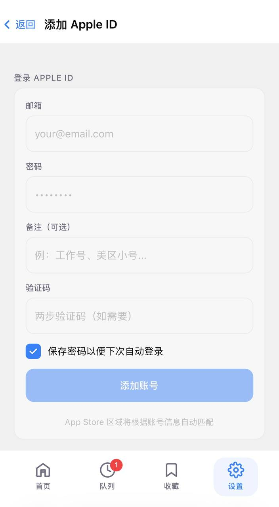
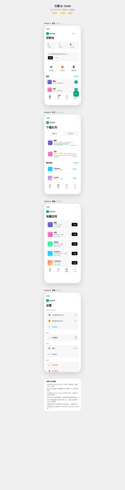

中文 | [English](../README.md)

<h1 align="center">ipaTool</h1>

<p align="center">
  移动端优先的 IPA 下载、归档与安装管理工具
</p>

<p align="center">
  
  
  
  <a href="https://github.com/ruanrrn/ipaTool/releases"></a>
</p>

---

## 功能特点

- 支持下载已下架应用
- 支持免费应用的购买
- 完整版本历史记录
- 版本收藏与备注
- 支持 OTA 安装或导出 IPA
- 多 Apple ID 管理

## 界面预览

| 首页 | 队列 | 收藏 |
|:----:|:----:|:----:|
|  |  |  |

| 设置 | 添加账户 | 版本选择 |
|:----:|:--------:|:--------:|
|  |  |  |

## 快速开始

### 方式一：一键安装（推荐）

运行以下命令，将启动交互式管理面板：

```bash
bash <(curl -fsSL https://cdn.jsdelivr.net/gh/ruanrrn/ipaTool@main/scripts/install.sh)
```

> 如果 jsDelivr 访问较慢，可使用 GitHub 直链：
> ```bash
> bash <(curl -fsSL https://raw.githubusercontent.com/ruanrrn/ipaTool/main/scripts/install.sh)
> ```

之后可随时重新打开管理面板：

```bash
sudo bash /opt/ipatool/manager.sh
```

---

### 方式二：Docker 部署

**使用 docker-compose：**

创建 `docker-compose.yml`：

```yaml
version: '3.8'

services:
  ipatool:
    image: heard/ipatool
    container_name: ipatool
    ports:
      - "8080:8080"
    volumes:
      - ipa-data:/app/data
      - ipa-downloads:/app/downloads
    restart: unless-stopped

volumes:
  ipa-data:
  ipa-downloads:
```

然后启动：

```bash
docker-compose up -d   # → http://localhost:8080
```

**使用 docker run：**

```bash
docker run -d -p 8080:8080 --name ipatool heard/ipatool:latest
```

**查看 / 重置管理员密码：**

推荐在启动时指定初始密码：

```bash
docker run -d -p 8080:8080 \
  -e IPA_ADMIN_INITIAL_PASSWORD='你的强密码' \
  --name ipatool heard/ipatool:latest
```

如未指定，可从日志中获取自动生成的密码：

```bash
docker logs ipatool 2>&1 | grep 'Generated one-time admin password'
```

重置密码：

```bash
docker exec -i ipatool ./server reset-admin-password --username admin --password-stdin <<< '新密码'
```

---

### 方式三：源码运行

**前提要求：** Node.js 18+ · pnpm · Rust 1.85+

**开发模式：**

```bash
pnpm install
pnpm run dev                        # 前端 → localhost:5173
cd server && cargo run --bin server # 后端 → localhost:8080
```

**生产构建：**

```bash
pnpm run build
rm -rf server/dist && cp -a dist/. server/dist/
cd server && cargo run --bin server
```

**查看 / 重置管理员密码：**

推荐通过环境变量指定初始密码：

```bash
cd server
IPA_ADMIN_INITIAL_PASSWORD='你的安全密码' cargo run --bin server
```

如未指定，查看终端输出中的：

```text
[SECURITY] Generated one-time admin password for first run: ...
```

重置密码：

```bash
cd server
printf '%s' '新密码' | cargo run --bin server -- reset-admin-password --username admin --password-stdin
```

如果数据库不在默认位置：

```bash
DATABASE_PATH=/path/to/ipa-webtool.db cargo run --bin server -- reset-admin-password --username admin --password-stdin
```

---

## HTTPS 配置（OTA 必需）

OTA 安装需要 HTTPS。常见方案：

| 方案 | 说明 |
|------|------|
| **Nginx + Let's Encrypt** | 使用 Certbot 自动申请免费证书，Nginx 反向代理到后端 8080 端口 |
| **Cloudflare Tunnel** | 通过 Cloudflare 隧道暴露服务，无需开放公网端口 |

Nginx 反向代理配置示例：

```nginx
server {
    listen 443 ssl;
    server_name your-domain.com;
    ssl_certificate     /etc/letsencrypt/live/your-domain.com/fullchain.pem;
    ssl_certificate_key /etc/letsencrypt/live/your-domain.com/privkey.pem;

    location / {
        proxy_pass http://127.0.0.1:8080;
        proxy_set_header Host $host;
        proxy_set_header X-Real-IP $remote_addr;
    }
}
```

## 技术栈

| 前端 | 后端 |
|------|------|
| Vue 3 + Vite 6 | Rust |
| Pinia | Actix Web |
| Tailwind CSS | rusqlite |
| | reqwest · tokio · OpenSSL (vendored) |

## 项目结构

```
├── frontend/            # Vue 3 前端
│   ├── index.html       # Vite 入口
│   ├── vite.config.js
│   ├── tailwind.config.js
│   ├── postcss.config.js
│   ├── eslint.config.js
│   ├── .prettierrc
│   ├── main.js          # 应用入口
│   ├── App.vue          # 根组件
│   ├── components/      # 组件
│   ├── composables/     # 组合式函数
│   ├── stores/          # Pinia 状态管理
│   └── utils/           # 工具函数
├── server/              # Rust 后端 (Actix Web)
│   ├── src/
│   ├── Cargo.toml
│   └── rustfmt.toml
├── scripts/             # 构建与运维脚本
│   ├── install.sh       # 一键管理脚本
│   ├── verify-build.sh
│   ├── sync-version.sh
│   └── check-no-hardcoded-colors.sh
├── docs/                # 文档与截图
│   ├── screenshots/
│   ├── learnings/
│   └── README.zh-CN.md  # 中文文档
├── .github/workflows/   # CI/CD (ci, docker, release)
├── Dockerfile
├── docker-compose.yml
├── .npmrc
├── package.json
├── pnpm-lock.yaml
└── README.md
```

## 开源协议

[MIT](../LICENSE)
